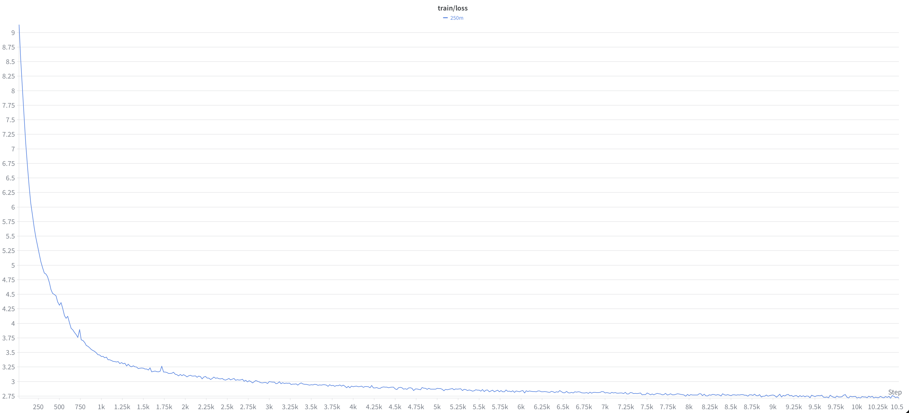

# CPT Gemma-3-1B (RU + EN) x MiniLM

Полная реализация Gemma-3-1B на PyTorch для continued pretraining на русском и
английском. Прунинг с 262 144 до 153 856 (601x256), веса-референс взяты из HF-чекпоинта Gemma-3-1B-pt.
Главная задача проекта - выжать максимум **скорости** ток/с руками.

Логиты сверены с HF `Gemma3ForCausalLM` на оригинальном `gemma-3-1b-pt`: `max|diff| = 2.4e-4`,
косинусное сходство 1.000, argmax 100%.

## Результат

В качестве данных для обучения взята синтетика со случайными токенами. Одна оптимизация за заход, затем замер.

Сетап: 1xA100-SXM4-80B, torch 2.12+cu130, triton 3.7.0, liger-kernel 0.8.0, dion@2723e97.

Ток/с замерялся медианой по шагам 10-60. Эффективный батч на всех ступенях одинаков — 32 seq x 2048 =
65 536 токенов за шаг: первые три ступени это микробатч 8 x accum 4, последние две — 16 x 2.
На каждом этапе проверялось совпадение лосса до 4-го знака.

| Конфигурация | ток/с | MFU | мс/шаг | Пиковая память |
|---|---:|---:|---:|---:|
| Без компиляции | 8 800 | 15.3% | 7 447 | 61.4 GiB |
| + `torch.compile` трансформера без головы | 10 590 | 18.4% | 6 189 | 40.9 GiB |
| + автотюн FlexAttention-шаблонов | 17 893 | 31.1% | 3 663 | 40.9 GiB |
| + микробатч 16 / accum 2 | 24 500 | 42.6% | 2 670 | 68.0 GiB |
| **+ изменения подачи чанков Liger FLCE, чанк 8192** | **34 197** | **59.4%** | **1 916** | **72.0 GiB** |

**3.89x к прогону без компиляции.** Профиль финального стека: GEMM ~67%, attention fwd+bwd ~9.5%, GeGLU ~5.4%, оптимизатор ~4%,
RMSNorm-редукции ~2-3%, CE ~2%. Вместе это ~90% времени GPU, остальное набирается мелкими операциями,
отдельно в трейсе не выделенными. GPU утилизация 99.6%.

### H100

Далее тот же стек был перенесён на 1xH100-80GB с той же конфигурацией. Лосс совпадает с A100 до 4-го знака.

| Конфигурация | ток/с | MFU | мс/шаг | Пиковая память |
|---|---:|---:|---:|---:|
| Без компиляции | 40 529 | 22.2% | 1 617 | 65.5 GiB |
| **Финальный стек (bf16)** | **76 940** | **42.2%** | **852** | **72.1 GiB** |
| + FP8 tensorwise\* | 79 471 | 43.6% | 825 | 56.1 GiB |

**1.90x к прогону без компиляции.** MFU считается от разного теоретического максимума - у H100 989 TFLOPs, а у A100 312,
поэтому 42.2% - это 2.25x абсолютной пропускной способности A100. Фактически 77k против 34.2k ток/с.

\* FP8 (torchao float8, 182 Linear-слоя трансформера в e4m3, голова и эмбеддинги остаются в bf16) даёт +3.3% ток/с
и −16 GiB. Стабильность проверялась отдельным прогоном на реальных данных: loss идёт вплотную к bf16
(eval@50 — 2.601 против 2.594).


## Как это получено

### Компиляция всей модели роняла процесс

`torch.compile` всей модели падает на лоссе с Liger кернелом. Принял решение компилировать только трансформер без головы.

### Backward FlexAttention занимал 36% времени GPU

30 мс на вызов при forward в 0.5 мс. Дефолтные конфиги backward-шаблона плохо работают на форме
H=4, head_dim=256, MQA 4:1, скользящее окно 512.

`max-autotune-no-cudagraphs` дает +69% к скорости.
Альтернатива через SDPA даёт 16.8k ток/с, но прибавляет +11.6 GiB, что не даёт поднять микробатч до 16.

### Стоковый Liger нарезал слишком мелкие чанки

Стоковый `LigerFusedLinearCrossEntropy` нарезал чанк в 256 строк. По 128 чанков на микрошаг вместо четырёх. Поставил `chunk_size=8192` что дало меньше маленьких GEMM-ов и проходов по grad_weight [153856 x 1152]. Прирост к скорости +40%.

## Архитектура

Gemma-3: RMSNorm, QK-norm, RoPE (глобальный 1M / локальный 10k), GeGLU MLP, MQA, чередование
sliding-window и global attention 5:1, weight tying.


## Запуск

Перед запуском стоит сделать уточнение, что требуется токенизатор пруненной Gemma-3 и собственно сама спуренная модель. Это пока не выложено. Профилирование скорости ниже работает без них, на синтетике.

```bash
pip install -r requirements.txt
```

Токенизация корпуса:
```bash
python scripts/preprocess_text.py \
  --tokenizer_path external/gemma3-1b-base/gemma-3-1b-pt-ruen-v2/tokenizer.json \
  --dataset_files data/raw/ru.txt data/raw/en.txt \
  --output_path data/pretrain --val_ratio 0.01
```

Запуск на 2 картах:
```bash
./run_ddp.sh
```

Подсчет перплексии на валидационной выборке
```bash
python -m evaluation.main perplexity --ckpt_path=./out_cpt_gemma_1b/ckpt.pt
```

Экспорт в HF формат
```bash
python -m conversion.convert_to_hf \
  --ckpt_path=./out_cpt_gemma_1b/ckpt.pt --out_dir=./export/gemma3-1b-cpt-ruen
cp external/gemma3-1b-base/gemma-3-1b-pt-ruen-v2/{tokenizer.json,tokenizer_config.json,special_tokens_map.json} \
   ./export/gemma3-1b-cpt-ruen/
```

Профилирование скорости на синтетике:

```bash
python scripts/make_synth_profile_data.py                       # 4M случайных токенов
python main.py --yaml_path=configs/profile_a100_1gpu.yaml       # Профайлинг на 60 шагов. Трейс в ./out_profile
python scripts/analyze_trace.py                                 # Анализ трейсов
```

Любое поле конфига переопределяется из CLI:

```bash
python main.py --yaml_path=configs/profile_a100_1gpu.yaml --use_flex_attention=False
python main.py --yaml_path=configs/profile_a100_1gpu.yaml --ce_chunk_size=4096 --use_liger=False
```

Метрики в логах и wandb каждые `log_interval` шагов: `tok/s`, `ms/step`, `MFU`, пиковая память.
Шаг компиляции из счётчиков исключён. При `profile: true` трейсятся шаги 11–13.

## Структура

```
├── main.py                         точка входа
├── config.py                       ModelArgs и TrainConfig
├── run_ddp.sh                      запуск torchrun на 2 GPU + NCCL
├── requirements.txt
├── configs/
│   ├── cpt_gemma_1b.yaml           боевой CPT
│   └── profile_a100_1gpu.yaml      профилирование на синтетике
├── models/
│   ├── minilm.py                   Gemma-3: эмбеддинги, 26 блоков, RoPE-кэши, маски
│   ├── transformer.py              блок с RMSNorm
│   ├── layers.py                   attention (FlexAttention / SDPA), GeGLU, RMSNorm, RoPE
│   ├── lm_head.py                  голова, выбор пути лосса, generate() с KV-кэшем
│   └── fused_loss.py               Liger FLCE со своей нарезкой чанков
├── training/
│   ├── trainer.py                  цикл обучения
│   ├── optim.py                    Muon (dion) для матриц + AdamW для эмбеддингов и скаляров
│   ├── checkpoint.py               загрузка весов Gemma-3 из HF safetensors
│   ├── distributed.py              инициализация DDP, сиды, TF32
│   └── ema.py                      EMA весов
├── dataio/
│   ├── dataset.py                  датасет-классы
│   └── loaders.py                  даталоадеры
├── scripts/
│   ├── preprocess_text.py          токенизация корпуса
│   ├── make_synth_profile_data.py  случайные токены для замеров скорости
│   └── analyze_trace.py            разбор трейса профайлера
├── conversion/
│   └── convert_to_hf.py            экспорт чекпоинта в HF Gemma3ForCausalLM
├── evaluation/
│   └── main.py                     перплексия на val.bin
└── utils/
    └── functions.py                снапшот конфига и исходников рядом с чекпоинтом
```

## MiniLM 250M

Данный репозиторий вырос из претрейна Llama-2-like модели на самостоятельно собранном корпусе текстов с целью переобучить сверх Chinchilla рекомендации.

Результат претрейна на кластере:



Лосс с 9.0 до ~2.75 за 10.5k шагов — гладко, без расхождений и спайков.

Код той модели остался в истории репозитория.

